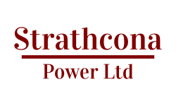

title: Strathcona Power
url:
jumbotron: True
jumbotron_color: #8B6D49
jumbotron_image: images/halkirk-895.jpg
image: images/halkirk-895.jpg
header: images/halkirk-895.jpg
save_as: index.html
status: hidden
article_listing: True
footer: 

Welcome!

<!-- Clear Description of who you are -->

Offering Power and Natural Gas across Alberta from old Strathcona, Edmonton.

We service homes, farms, and small commercial across the province.

  

[Electricity Rates]({filename}10-electricity.md)
  

  

[Natural Gas Rates]({filename}20-natural-gas.md)
  

  

  <!-- obvious Call to Action -->
  <button type="button" class="btn btn-lg btn-primary text-center" markdown=1>
[Sign up now!](https://billhub.ca/signup/strathconapower)
  </button>
  

Switching is super simple. We ask you for your address and some information
about you, and for payment information. We'll reach out in the rare case we
need anything more. Ten days later, you're flowing with us! Your first bill
will come about six weeks after you complete the sign up process.

<!-- easy to find Contact Information -- in footer -->
If you have any questions about signing up or your bill, drop us an email:
[CustomerCare@StrathconaPower.ca](mailto:customercare@strathconapower.ca?subject=Website question).

<!-- Customer Testimonials -->

---

<!-- fresh quality content -- blog's Recent Articles -->

## Latest News

<!-- Site Map -- in footer? -->
